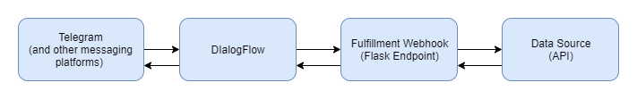
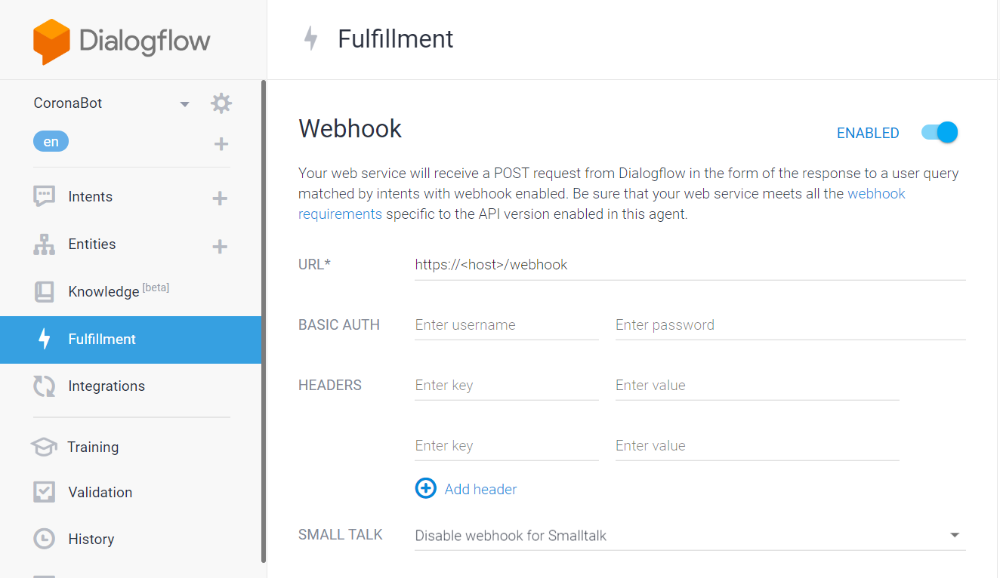
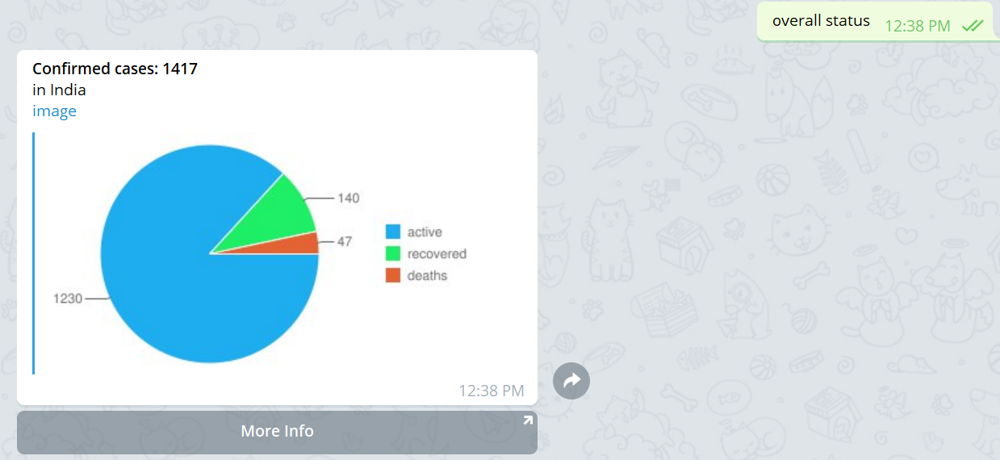

Corono India Stats chatbot 
---------------

A telegram chatbot which responds with latest corona virus statistics from India. 

Bot available here - http://t.me/CoronaIndiaStatsBot 

----

**How it works:**




**DialogFlow Agent:** 

Create a new [dialogflow](https://dialogflow.com/) agent and create intents and entities. You can import the exported agent available in the folder `/dialogflow-agent`.  

**Telegram setup:** 

Follow the instructions as shown here: 
https://cloud.google.com/dialogflow/docs/integrations/telegram

**Fulfillment webhook:** 

The webhook code is available in `server.py`. Start the flask server by running: 
```bash
python server.py
```
For production, use a Python web server like gunicorn: 
```bash
gunicorn server:app
```

Deploy the webhook to cloud or run it locally  and expose it as a public URL using [ngrok](https://ngrok.com/). 

Once deployed, configure the webhook in dialogflow as shown below: 



**Data sources:** 

- https://api.rootnet.in/ 
- https://api.covid19india.org/


**Image Charts:**

The bot responds with image charts for some intents as shown below: 



It uses Google [Image Chart API](https://developers.google.com/chart/image) to generate charts as images. Google has officially sunset this API, but it is working as of now. 

Below are some alternatives which could be used as replacement: 
- https://www.image-charts.com/
- https://quickchart.io/ 
- Running [Chartjs](https://www.chartjs.org/) on [server-side](https://github.com/vmpowerio/chartjs-node) 
